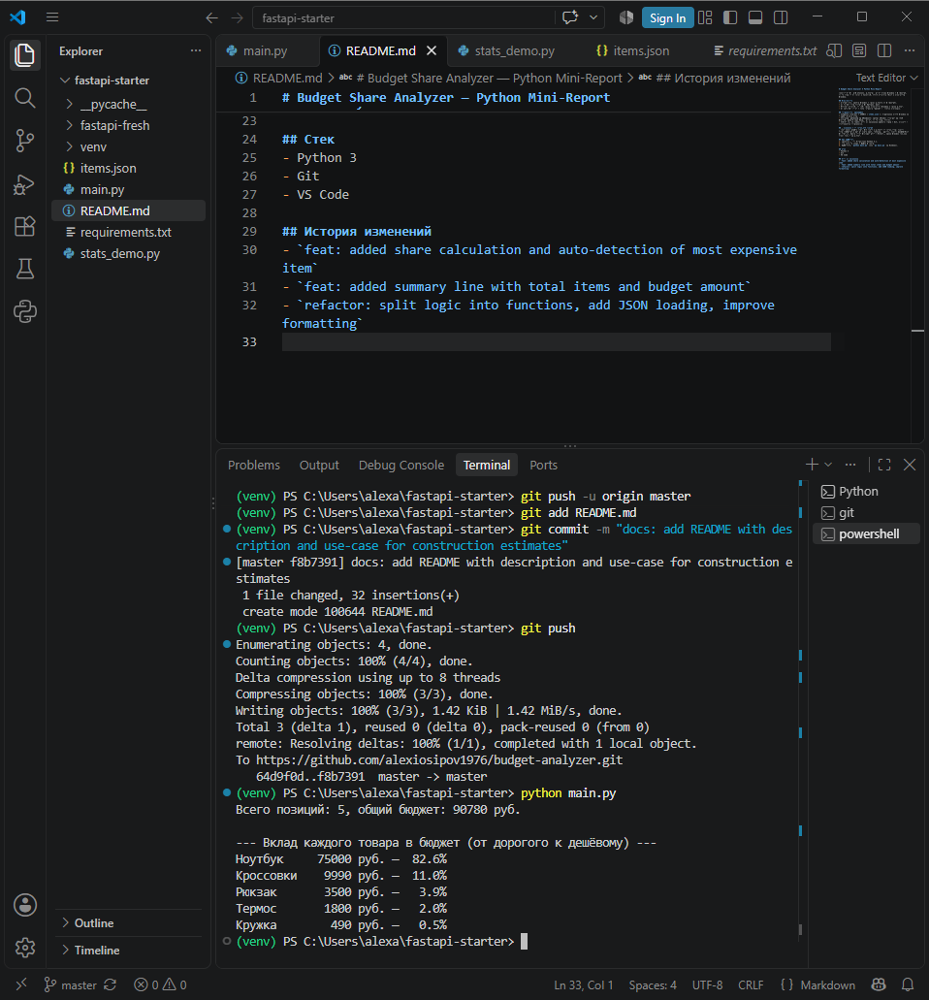

# Budget Share Analyzer — Python Mini-Report

Мини-отчёт по распределению бюджета: расчёт долей позиций в процентах, сортировка от дорогого к дешёвому, вывод итоговой суммы и количества позиций.

## Возможности
- Считает долю каждой позиции в общем бюджете (в процентах).
- Сортирует товары/статьи по убыванию цены.
- Выводит итоговую строку: общее количество позиций и общий бюджет.
- Форматирует отчёт в виде читаемой таблицы с ровными колонками.

## Особенности реализации
- **Данные вынесены в JSON** (`items.json`): добавление новых позиций не требует правки кода.
- **Логика разделена на функции**: каждая функция отвечает за одну понятную задачу (загрузка, расчёт, сортировка, вывод).
- **Контроль версий**: история изменений зафиксирована в Git, коммиты с осмысленными сообщениями.

## Применение в строительных сметах
Проект легко адаптировать под сметы и бюджеты строительства: вместо товаров — статьи затрат (материалы, техника, работы), вместо цен — суммы по статьям. Такой отчёт помогает быстро увидеть, какие позиции сильнее всего влияют на бюджет.

## Как запустить
1. Убедитесь, что установлен Python 3.x.
2. Откройте терминал в папке проекта.
3. Запустите: `python main.py` (или `py main.py` на Windows).

## Стек
- Python 3
- Git
- VS Code

## История изменений
- `feat: added share calculation and auto-detection of most expensive item`
- `feat: added summary line with total items and budget amount`
- `refactor: split logic into functions, add JSON loading, improve formatting`

